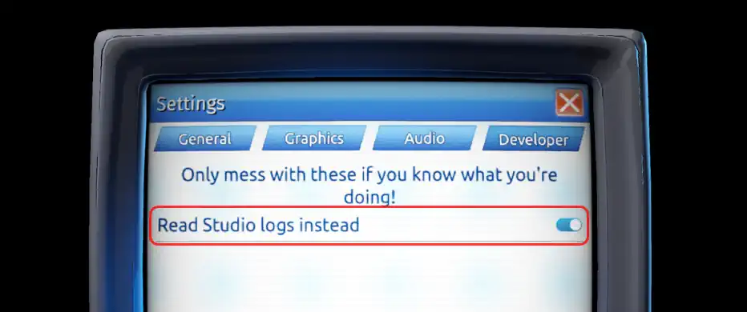
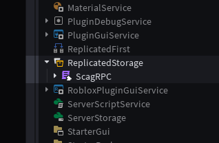

# Getting Started

In order to use ScagRPC, you need to have ScagJPT installed on your computer. You can buy it from [Steam](https://store.steampowered.com/app/4721090/ScagJPT/).

## Testing in Roblox Studio

When testing in Roblox Studio, make sure the "Read Studio logs instead" setting is **enabled** in ScagJPT's settings. This allows your Roblox Studio logs to be read, instead of the Roblox Player. You can find this setting in the "Developer" tab.

:::warning
When you want to use ScagJPT in a published game, don't forget to **disable** the "Read Studio logs instead" setting!
:::

## Setting up ScagRPC

When you download ScagRPC from the [Roblox Marketplace](https://www.roblox.com/library/13815518713/ScagRPC), you get a ModuleScript that other scripts can require from. You can place this ModuleScript anywhere, but it's recommended to be under `ReplicatedStorage`.

