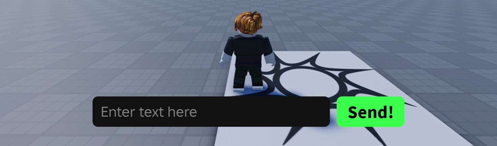
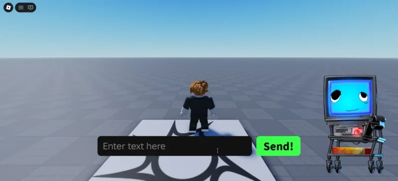

# Client

Setting up ScagJPT on the client is the easiest way to have Scag react to in-game events.

Because ScagJPT checks your local machine for logs, all you need to do is use [`print()`](https://create.roblox.com/docs/reference/engine/globals/LuaGlobals#print) to send messages to ScagJPT.


## Button Example

Here, we set up a basic UI in Roblox Studio.
- A `TextButton` and `TextBox` parented to a `ScreenGui` for the UI
- A `LocalScript` (also parented to the `ScreenGui`) to handle the button behavior



Under the `LocalScript`, we'll write a code that sends the text from `TextBox` to ScagJPT when `TextButton` is pressed.\n
We can use the `ScagRPC.Say()` function.
```lua
-- LocalScript
local ReplicatedStorage = game:GetService("ReplicatedStorage")

local ScagRPC = require(ReplicatedStorage.ScagRPC)

local TextBox = script.Parent.TextBox
local Send = script.Parent.TextButton

Send.Activated:Connect(function()
	local text = TextBox.Text
	ScagRPC.Say(text)
end)
```

And we're done!

When you click the button, ScagJPT will say whatever text is in the `TextBox`.

